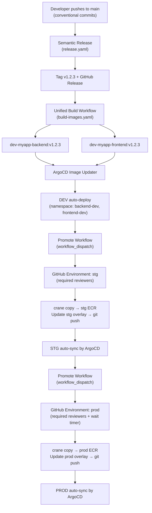

# Professional GitOps Pipeline - Senior Principal Approach

## Architektura docelowa




## Obecny stan vs. docelowy

**Problemy do naprawienia:**

- `ci-backend.yaml` miesza CI (lint), release-please (konflikt z semantic-release) i CD (push) w jednym workflow
- `build-frontend.yaml` ma `ECR_REPOSITORY: test` (niepoprawne) i łączy CI z CD
- `.github/build-push.yaml` jest niedokończony (brak steps)
- Brak frontendowych manifestów Kubernetes (puste pliki)
- Brak overlays dla stg/prod
- Brak mechanizmu promocji między środowiskami
- ArgoCD Image Updater skonfigurowany tylko dla backend-dev

---

## Faza 1: Rozdzielenie CI od CD

### 1.1 Refaktor `ci-backend.yaml` - tylko linting/testy na PR

Usunac joby `release-please` i `push`. Zostaje tylko `lint`:

```yaml
name: CI Backend
on:
  pull_request:
    paths: ['02-app-source-code/backend/**']
jobs:
  lint:
    runs-on: ubuntu-latest
    steps:
      - uses: actions/checkout@v4
      - uses: actions/setup-go@v5
        with:
          go-version: '1.25.6'
      - uses: golangci/golangci-lint-action@v9
        with:
          working-directory: ./02-app-source-code/backend
```

### 1.2 Refaktor `build-frontend.yaml` → `ci-frontend.yaml` - tylko lint/test na PR

Zostawiamy tylko job `integration` (lint + test + trivy FS scan). Usuwamy job `delivery`.

### 1.3 Wyczysc `release.yaml`

Usunac zakomentowany kod release-please. Zostawic tylko Semantic Release (dziala poprawnie).

---

## Faza 2: Unified Build Workflow

### 2.1 Nowy plik: `.github/workflows/build-images.yaml`

Jeden workflow triggerowany przez tag `v*.*.*` - buduje OBA serwisy z tym samym tagiem:

```yaml
name: Build and Push Container Images

on:
  push:
    tags: ['v*.*.*']

permissions:
  id-token: write
  contents: read

env:
  AWS_REGION: eu-central-1
  AWS_ACCOUNT_ID: '438950223046'

jobs:
  build:
    runs-on: ubuntu-latest
    strategy:
      matrix:
        include:
          - service: backend
            context: ./02-app-source-code/backend
            ecr_repo: dev-myapp-backend
          - service: frontend
            context: ./02-app-source-code/frontend
            ecr_repo: dev-myapp-frontend
    steps:
      - uses: actions/checkout@v4
      - uses: aws-actions/configure-aws-credentials@v4
        with:
          role-to-assume: arn:aws:iam::${{ env.AWS_ACCOUNT_ID }}:role/GitHubActionRole
          aws-region: ${{ env.AWS_REGION }}
      - uses: aws-actions/amazon-ecr-login@v2
        id: login-ecr
      - uses: docker/setup-buildx-action@v3
      - uses: docker/build-push-action@v6
        with:
          context: ${{ matrix.context }}
          push: true
          tags: |
            ${{ steps.login-ecr.outputs.registry }}/${{ matrix.ecr_repo }}:${{ github.ref_name }}
          cache-from: type=gha,scope=${{ matrix.service }}
          cache-to: type=gha,mode=max,scope=${{ matrix.service }}
```

### 2.2 Usunac stary `.github/build-push.yaml` (niedokonczony, zly path - nie w `workflows/`)

---

## Faza 3: Promotion Workflow

### 3.1 Nowy plik: `.github/workflows/promote.yaml`

Kluczowy workflow - promuje wersje miedzy srodowiskami z wymaganym zatwierdzeniem:

```yaml
name: Promote Release

on:
  workflow_dispatch:
    inputs:
      version:
        description: 'Version tag to promote (e.g., v1.2.3)'
        required: true
      target_env:
        description: 'Target environment'
        required: true
        type: choice
        options: [stg, prod]
      services:
        description: 'Services to promote'
        required: true
        type: choice
        options: [all, backend, frontend]
        default: all

jobs:
  promote:
    runs-on: ubuntu-latest
    environment: ${{ inputs.target_env }}  # <-- GitHub Environment gate
    steps:
      - uses: actions/checkout@v4
      - uses: aws-actions/configure-aws-credentials@v4
        # ... AWS auth
      - name: Install crane
        uses: imjasonh/setup-crane@v0.4
      - name: Copy images to target ECR
        run: |
          SOURCE_PREFIX="dev-myapp"
          TARGET_PREFIX="${{ inputs.target_env }}-myapp"
          for svc in backend frontend; do
            crane copy \
              ${ECR_REGISTRY}/${SOURCE_PREFIX}-${svc}:${{ inputs.version }} \
              ${ECR_REGISTRY}/${TARGET_PREFIX}-${svc}:${{ inputs.version }}
          done
      - name: Update Kustomize overlay
        run: |
          cd 04-gitops-apps/manifests
          for svc in backend frontend; do
            cd ${svc}/overlays/${{ inputs.target_env }}
            kustomize edit set image \
              *-myapp-${svc}=${ECR_REGISTRY}/${{ inputs.target_env }}-myapp-${svc}:${{ inputs.version }}
            cd ../../../
          done
      - name: Commit and push
        run: |
          git config user.name "github-actions[bot]"
          git config user.email "github-actions[bot]@users.noreply.github.com"
          git add 04-gitops-apps/
          git commit -m "promote: ${{ inputs.version }} → ${{ inputs.target_env }}"
          git push
```

---

## Faza 4: ECR - Repozytoria dla stg/prod (Terraform)

### 4.1 Modyfikacja `01-terraform-infra/global/ecr/main.tf`

Dodaj moduły dla stg i prod, wykorzystujac istniejacy modul [01-terraform-infra/modules/ecr/main.tf](01-terraform-infra/modules/ecr/main.tf):

```hcl
locals {
  environments = ["dev", "stg", "prod"]
  services     = ["backend", "frontend"]
}

module "ecr" {
  source   = "../../modules/ecr"
  for_each = { for pair in setproduct(local.environments, local.services) :
    "${pair[0]}-${pair[1]}" => {
      env     = pair[0]
      service = pair[1]
    }
  }

  repository_name = "${each.value.env}-${var.project}-${each.value.service}"
  github_repo     = var.github_repo
}
```

To tworzy 6 repozytoriów: `dev-myapp-backend`, `dev-myapp-frontend`, `stg-myapp-backend`, `stg-myapp-frontend`, `prod-myapp-backend`, `prod-myapp-frontend`.

### 4.2 IAM Role

Obecny modul ECR tworzy osobna role IAM per repo. Dla promote workflow potrzebna jest rola z dostepem do WSZYSTKICH ECR repos. Rozwazyc dodanie jednej roli `GitHubPromoteRole` z uprawnieniami do stg/prod ECR.

---

## Faza 5: Kustomize Manifesty

### 5.1 Popraw base deployment - usun hardcoded namespace/name

Plik [04-gitops-apps/manifests/backend/base/deployment.yaml](04-gitops-apps/manifests/backend/base/deployment.yaml) ma hardcoded `namespace: backend-dev` i `name: backend-dev`. Base powinien byc generyczny:

```yaml
metadata:
  name: backend       # bez suffixu env
  # bez namespace - overlay ustawia przez kustomization.yaml
```

Kazdy overlay ustawia namespace i name prefix przez `kustomization.yaml`:

```yaml
# overlays/dev/kustomization.yaml
namespace: backend-dev
namePrefix: dev-
resources:
  - ../../base
images:
  - name: 438950223046.dkr.ecr.eu-central-1.amazonaws.com/dev-myapp-backend
    newTag: v1.2.3
```

### 5.2 Stworz overlays dla stg i prod (backend)

- `04-gitops-apps/manifests/backend/overlays/stg/kustomization.yaml`
- `04-gitops-apps/manifests/backend/overlays/prod/kustomization.yaml`

Roznice miedzy srodowiskami: replicas, resources limits, namespace.

### 5.3 Stworz kompletne manifesty frontend

- `04-gitops-apps/manifests/frontend/base/deployment.yaml` - analogicznie do backend
- `04-gitops-apps/manifests/frontend/base/service.yaml` - ClusterIP port 80 (nginx)
- `04-gitops-apps/manifests/frontend/overlays/{dev,stg,prod}/kustomization.yaml`

---

## Faza 6: ArgoCD Applications

### 6.1 Backend stg/prod apps

Pliki `04-gitops-apps/apps/backend-stg-app.yaml` i `backend-prod-app.yaml`:

- **BEZ** ArgoCD Image Updater (promocja jest manualna przez GitHub Actions)
- `syncPolicy.automated` - auto-sync po git push (przez promote workflow)
- `destination.server` - URL klastra stg/prod (do uzupelnienia po provisioning infra)

### 6.2 Frontend apps (dev/stg/prod)

- `frontend-dev-app.yaml` z Image Updater (auto-deploy jak backend-dev)
- `frontend-stg-app.yaml` i `frontend-prod-app.yaml` bez Image Updater

### 6.3 Update Image Updater config

Rozszerz [04-gitops-apps/apps/backend-dev-app.yaml](04-gitops-apps/apps/backend-dev-app.yaml) - dodaj frontend-dev do obserwowanych obrazow.

---

## Faza 7: GitHub Environments

Skonfiguruj w Settings → Environments na GitHubie:

- **dev** - brak ochrony (auto-deploy)
- **stg** - Required reviewers (1-2 osoby)
- **prod** - Required reviewers (2+ osoby) + Wait timer (np. 30 min) + Deployment branches: only `main`

---

## Faza 8: Multi-cluster ArgoCD (po provisioning infra)

Gdy klastry stg/prod beda gotowe:

1. Zarejestruj klastry w ArgoCD: `argocd cluster add <context-name>`
2. Zaktualizuj `destination.server` w ArgoCD apps stg/prod na URL nowych klastrow
3. Dodaj ECR pull secrets na nowych klastrach

---

## Podsumowanie koncowego flow

```
feat: add user profile → push to main
    → Semantic Release → v1.3.0 tag + GitHub Release
    → build-images.yaml → backend:v1.3.0 + frontend:v1.3.0 → dev ECR
    → Image Updater → auto-deploy dev
    → [manual] promote.yaml (stg) → reviewer approves → crane copy → stg ECR + overlay update → ArgoCD syncs stg
    → [manual] promote.yaml (prod) → 2 reviewers approve → 30min wait → crane copy → prod ECR + overlay update → ArgoCD syncs prod
```

## Pliki do zmiany/utworzenia


| Akcja           | Plik                                                                           |
| --------------- | ------------------------------------------------------------------------------ |
| Refaktor        | `.github/workflows/ci-backend.yaml` (tylko lint)                               |
| Rename+Refaktor | `.github/workflows/build-frontend.yaml` → `ci-frontend.yaml` (tylko lint/test) |
| Cleanup         | `.github/workflows/release.yaml` (usun komentarze)                             |
| Nowy            | `.github/workflows/build-images.yaml`                                          |
| Nowy            | `.github/workflows/promote.yaml`                                               |
| Usun            | `.github/build-push.yaml`                                                      |
| Refaktor        | `01-terraform-infra/global/ecr/main.tf` (for_each envs)                        |
| Popraw          | `04-gitops-apps/manifests/backend/base/deployment.yaml`                        |
| Nowy            | `04-gitops-apps/manifests/backend/overlays/stg/kustomization.yaml`             |
| Uzupelnij       | `04-gitops-apps/manifests/backend/overlays/prod/kustomization.yaml`            |
| Uzupelnij       | `04-gitops-apps/manifests/frontend/base/deployment.yaml`                       |
| Uzupelnij       | `04-gitops-apps/manifests/frontend/base/service.yaml`                          |
| Nowy            | `04-gitops-apps/manifests/frontend/overlays/{dev,stg,prod}/kustomization.yaml` |
| Uzupelnij       | `04-gitops-apps/apps/backend-prod-app.yaml`                                    |
| Nowy            | `04-gitops-apps/apps/backend-stg-app.yaml`                                     |
| Uzupelnij       | `04-gitops-apps/apps/frontend-dev-app.yaml`                                    |
| Nowy            | `04-gitops-apps/apps/frontend-stg-app.yaml`                                    |
| Uzupelnij       | `04-gitops-apps/apps/frontend-prod-app.yaml`                                   |


