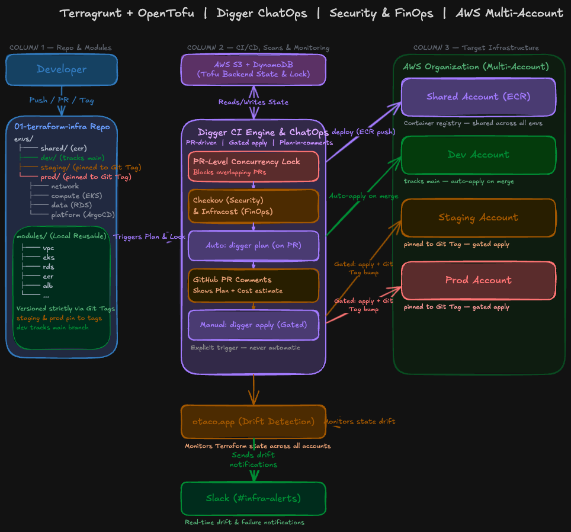

  
  
  
  
  
  

  
  
  

# ☁️ End-to-End Cloud Native Platform (AWS, EKS, GitOps)
Hi there! Welcome to my comprehensive Cloud & DevOps portfolio project. As a Junior DevOps Engineer, I built this end-to-end platform to demonstrate production-grade architecture, moving beyond simple tutorials to solve real-world engineering problems like FinOps, Shift-Left Security, and Day-2 Operations.

## 📑 Table of Contents

* **[Part 1: Infrastructure as Code (OpenTofu, Terragrunt, Digger)](#-part-1-infrastructure-as-code-opentofu--terragrunt)**
  * [1.1 Infrastructure Workflow & Architecture](#11-infrastructure-workflow--architecture)
  * [1.2 Infrastructure Design Decisions (Why this stack?)](#12-infrastructure-design-decisions-why-this-stack)
  * [1.3 Biggest Challenges in Terraform & IaC](#13-biggest-challenges-in-terraform--iac)
* **[Part 2: Application CI/CD & DevSecOps (GitHub Actions)](#-part-2-application-cicd--devsecops) ⏳** *(Coming next)*
* **[Part 3: GitOps & Kubernetes Platform (ArgoCD)](#-part-3-gitops--kubernetes-platform) ⏳** *(Coming next)*

## Part 1: Infrastructure as Code (OpenTofu & Terragrunt)
This section focuses on the bedrock of the project: the cloud infrastructure. It details how the underlying AWS environments are provisioned from scratch using OpenTofu and Terragrunt. Before any application code can be deployed, this layer ensures that the necessary networks, databases, and Kubernetes clusters are securely up and running.

 

### 🗺️ 1.1 Architecture Overview

  

 

### 🚀 1.2 How It Works (The Workflow)
When I want to introduce a change to the infrastructure (e.g., spinning up a new RDS instance or modifying a VPC), I don't run commands from my local terminal. Instead, I follow a strict Git-driven ChatOps workflow:

1. **Opening a Pull Request:** Pushing code automatically triggers my Digger CI/CD pipeline.
2. **Shift-Left Security & FinOps:** Before any infrastructure is touched, the pipeline runs `Checkov` to scan for security misconfigurations. Simultaneously, `Infracost` analyzes the code to estimate the AWS bill impact. Both reports are injected directly into the PR comments.
3. **PR-Level Concurrency Locks:** Digger locks the specific environment and layer I'm working on, preventing race conditions and corrupted state files if another team member opens a concurrent PR.
4. **Gated ChatOps Deployment:** To deploy changes to Staging or Production, merging the PR is not enough. I must explicitly type `digger apply` in the PR comments. This human-in-the-loop gate ensures no infrastructure is mutated accidentally.

 

### 🤔 1.3 Infrastructure Design Decisions (Why this stack?)

* **Why OpenTofu instead of standard Terraform?**
  After HashiCorp changed Terraform's license to BSL and announced the end of the free HCP Terraform plan (shifting to a per-resource pricing model), I wanted to avoid vendor lock-in. By migrating to OpenTofu (a true open-source alternative), I keep my costs close to zero while securely managing my own state backend using inexpensive AWS S3 buckets and DynamoDB for state locking.

* **Why Terragrunt?**
  To avoid copy-pasting EKS and VPC definitions across `dev`, `staging`, and `prod`, I used Terragrunt. The actual infrastructure logic lives securely in versioned, reusable modules (`modules/`), and my environment folders (`envs/`) only contain the specific variables for that environment.

* **Why an AWS Multi-Account Strategy?**
  I separated `dev`, `staging`, and `prod` into completely isolated AWS accounts within an AWS Organization. This strictly limits the **blast radius** of any potential failure. I also introduced a `shared` account that acts as a central hub for my ECR container registry.

* **Why Digger instead of standard GitHub Actions?**
  Standard CI/CD tools struggle with IaC state conflicts. Digger natively handles PR-level locks and provides a ChatOps experience, allowing me to control deployments via GitHub comments without giving GitHub direct administrative access to my AWS accounts.

 

### 🚧 1.4 Biggest Infrastructure Challenges

#### 1. The Dependency "Chicken and Egg" Problem
Early on, I tried to provision the entire environment (VPC, EKS, RDS, ArgoCD) in one run. It failed spectacularly because resources depend on each other sequentially. 
* **The Fix:** I broke the architecture down into logical layers: `network` -> `compute` -> `data` -> `platform`. To make this work seamlessly with Terragrunt, I utilized Terragrunt `dependency` blocks. This allows my `compute` layer to dynamically pull the VPC ID from the `network` layer's state file, and I used `mock_outputs` so that `terragrunt run-all plan` doesn't crash even if the VPC hasn't been created yet.

#### 2. Hitting the Limits of Raw GitHub Actions (Adopting Digger)
At first, I tried to build the CI/CD pipeline entirely from scratch using native GitHub Actions. I wrote complex workflows using matrix strategies and path filters (`dorny/paths-filter`) to trigger specific Terraform layers (like only planning the `network` layer if changes were detected there). I even wrote custom scripts (`actions/github-script`) to parse the `terraform plan` output and format it into PR comments.
While it worked, it became a massive maintenance burden. Handling state locks properly, queuing concurrent Pull Requests, and ensuring secure Role-Based Access Control inside GitHub Actions was overly complex.
* **The Fix:** I ripped out the overly complex YAML pipelines and adopted **Digger**. Digger natively solved PR-level concurrency locks and ChatOps (running plans and applies via comments) right out of the box, allowing me to focus on infrastructure rather than maintaining CI/CD boilerplate.